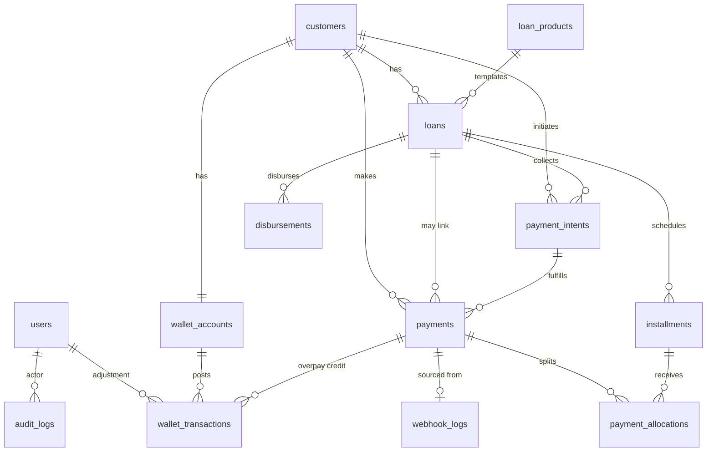

# 03 — Entity Relationship Design

**Project:** Mini Loan Management System  
**Repo:** `mini-loan-ms-api`  
**Milestone:** 2 — Database design  
**Status:** Complete  
**Schema style:** Approach B — Intent + allocation + audit (pragmatic financial schema)

**Upstream:**  
- [`01-project-understanding.md`](./01-project-understanding.md)  
- [`02-system-design.md`](./02-system-design.md)  
- ADRs: [0001](./adr/0001-flat-interest.md) · [0002](./adr/0002-payment-intent-identity.md) · [0003](./adr/0003-credit-wallet-overpayment.md) · [0004](./adr/0004-sms-evidence-fallback.md)

**Downstream:** Laravel migrations in **Milestone 3** (physical DDL). This document is the contract migrations must implement.

---

## 1. Purpose

Define tables, columns, types, keys, indexes, and integrity rules so that:

- Money never uses floating point.
- Payment attempts are identified by **internal Payment Intent UUIDs**.
- Safaricom identifiers are nullable **metadata** (indexable, not structural FKs).
- Allocations, wallet movements, webhooks, and audits are reconstructable.

---

## 2. Global data rules

| Rule | Choice |
|------|--------|
| Money | `DECIMAL(15,2)` — never `FLOAT` / `DOUBLE` |
| Rates | `DECIMAL(8,4)` for interest rate fields |
| Currency | KES; `CHAR(3)` default `'KES'` where stored |
| Primary keys | `BIGINT UNSIGNED` auto-increment `id` unless noted |
| Public ids | UUID/ULID strings, **unique** (`payment_intents.uuid`, `payments.uuid`, `disbursements.uuid`) |
| Timestamps | `created_at`, `updated_at` on mutable tables |
| Soft deletes | **Not** on money tables |
| FK on delete | `RESTRICT` for financial relationships — no cascade wipe of payments/allocations |
| Physical migrations | Milestone 3 |

---

## 3. Entity inventory

| Table | Module | Role |
|-------|--------|------|
| `users` | Auth | Ops officers (Sanctum) |
| `customers` | Customers | Borrowers; phone = default MSISDN |
| `loan_products` | LoanProducts | Reusable flat-interest templates |
| `loans` | Loans | Application / account + lifecycle |
| `installments` | Installments | Schedule lines |
| `disbursements` | Disbursements | Auditable B2C attempts |
| `payment_intents` | Payments | Internal repayment attempt identity |
| `payments` | Payments | Posted payment from evidence |
| `payment_allocations` | Payments | Payment → installment amounts |
| `wallet_accounts` | Wallet | Per-customer credit balance |
| `wallet_transactions` | Wallet | Auditable wallet credits/debits |
| `webhook_logs` | Infra/Audit | Raw Daraja/SMS payloads |
| `audit_logs` | Audit | Domain transition history |

---

## 4. ER diagram

---

## 5. Status vocabularies

Stored as strings (Laravel Enums in app). Exact migration string lengths: `VARCHAR(32)` unless noted.

### loans.status
`pending` → `approved` → `disbursement_requested` → `disbursed` → `active` → `completed` → `closed`

Disbursement **failure** is recorded on `disbursements.status = failed`. Loan remains `disbursement_requested` or returns to `approved` per Disbursement domain rules (Milestone 9) — schema supports either via loan status updates + disbursement row.

### disbursements.status
`pending` | `submitted` | `successful` | `failed`

### payment_intents.status
`pending` | `submitted` | `awaiting_callback` | `matched` | `allocated` | `completed` | `expired` | `failed` | `cancelled`

### installments.status
`scheduled` | `due` | `partially_paid` | `paid` | `overdue`

### payments.status
`pending` | `posted` | `reversed`

### webhook_logs.processing_status
`received` | `processed` | `ignored_duplicate` | `failed` | `unmatched`

### payments.evidence_source
`daraja_stk` | `sms_forwarder` | `manual`

### wallet_transactions.type
`credit` | `debit`

### wallet_transactions.reason
`overpayment` | `repayment_drawdown` | `adjustment`

---

## 6. Data dictionary

### 6.1 `users`

| Column | Type | Null | Notes |
|--------|------|------|-------|
| id | BIGINT UNSIGNED PK | no | |
| name | VARCHAR(255) | no | |
| email | VARCHAR(255) | no | UNIQUE |
| password | VARCHAR(255) | no | |
| remember_token | VARCHAR(100) | yes | |
| created_at / updated_at | TIMESTAMP | yes | |

### 6.2 `customers`

| Column | Type | Null | Notes |
|--------|------|------|-------|
| id | BIGINT UNSIGNED PK | no | |
| name | VARCHAR(255) | no | |
| phone | VARCHAR(32) | no | **UNIQUE**, normalized |
| id_number | VARCHAR(64) | no | INDEX |
| email | VARCHAR(255) | yes | |
| created_at / updated_at | TIMESTAMP | yes | |

### 6.3 `loan_products`

| Column | Type | Null | Notes |
|--------|------|------|-------|
| id | BIGINT UNSIGNED PK | no | |
| name | VARCHAR(255) | no | |
| interest_model | VARCHAR(32) | no | default `flat` |
| interest_rate | DECIMAL(8,4) | no | |
| term_unit | VARCHAR(16) | no | `months` \| `weeks` |
| term_length | INT UNSIGNED | no | |
| fee_amount | DECIMAL(15,2) | no | default 0 |
| is_active | BOOLEAN | no | default true |
| created_at / updated_at | TIMESTAMP | yes | |

### 6.4 `loans`

| Column | Type | Null | Notes |
|--------|------|------|-------|
| id | BIGINT UNSIGNED PK | no | |
| customer_id | FK → customers.id | no | RESTRICT |
| loan_product_id | FK → loan_products.id | no | RESTRICT |
| principal_amount | DECIMAL(15,2) | no | |
| currency | CHAR(3) | no | default `KES` |
| status | VARCHAR(32) | no | INDEX |
| approved_at | TIMESTAMP | yes | |
| disbursed_at | TIMESTAMP | yes | |
| activated_at | TIMESTAMP | yes | |
| closed_at | TIMESTAMP | yes | |
| created_at / updated_at | TIMESTAMP | yes | |

Indexes: `(customer_id, status)`, `(status)`

### 6.5 `installments`

| Column | Type | Null | Notes |
|--------|------|------|-------|
| id | BIGINT UNSIGNED PK | no | |
| loan_id | FK → loans.id | no | RESTRICT |
| sequence | INT UNSIGNED | no | |
| due_date | DATE | no | |
| principal_due | DECIMAL(15,2) | no | |
| interest_due | DECIMAL(15,2) | no | |
| fee_due | DECIMAL(15,2) | no | default 0 |
| amount_due | DECIMAL(15,2) | no | typically sum of dues |
| amount_paid | DECIMAL(15,2) | no | default 0 |
| status | VARCHAR(32) | no | |
| created_at / updated_at | TIMESTAMP | yes | |

Constraints: **UNIQUE** `(loan_id, sequence)`  
Index: `(loan_id, status)`, `(due_date)`

### 6.6 `disbursements`

| Column | Type | Null | Notes |
|--------|------|------|-------|
| id | BIGINT UNSIGNED PK | no | |
| uuid | CHAR(36) | no | **UNIQUE** |
| loan_id | FK → loans.id | no | RESTRICT |
| amount | DECIMAL(15,2) | no | |
| phone | VARCHAR(32) | no | |
| status | VARCHAR(32) | no | |
| requested_at | TIMESTAMP | yes | |
| completed_at | TIMESTAMP | yes | |
| daraja_conversation_id | VARCHAR(64) | yes | metadata |
| daraja_originator_conversation_id | VARCHAR(64) | yes | metadata |
| daraja_transaction_id | VARCHAR(64) | yes | metadata |
| request_payload | JSON | yes | |
| response_payload | JSON | yes | |
| error_message | TEXT | yes | |
| created_at / updated_at | TIMESTAMP | yes | |

Indexes: `(loan_id, status)`, metadata columns optional for ops search

### 6.7 `payment_intents`

| Column | Type | Null | Notes |
|--------|------|------|-------|
| id | BIGINT UNSIGNED PK | no | |
| uuid | CHAR(36) | no | **UNIQUE** — primary business identity |
| customer_id | FK → customers.id | no | RESTRICT |
| loan_id | FK → loans.id | no | RESTRICT |
| amount | DECIMAL(15,2) | no | |
| phone | VARCHAR(32) | no | |
| status | VARCHAR(32) | no | |
| attempt_number | INT UNSIGNED | no | default 1 |
| expires_at | TIMESTAMP | no | |
| submitted_at | TIMESTAMP | yes | |
| merchant_request_id | VARCHAR(64) | yes | Safaricom metadata |
| checkout_request_id | VARCHAR(64) | yes | Safaricom metadata |
| metadata | JSON | yes | |
| created_at / updated_at | TIMESTAMP | yes | |

Indexes: `(phone, status, created_at)`, `(loan_id, status)`, `(expires_at, status)`  
Optional unique on `checkout_request_id` where not null (DB-specific partial unique — enforce in app if MySQL version lacks partial indexes)

### 6.8 `payments`

| Column | Type | Null | Notes |
|--------|------|------|-------|
| id | BIGINT UNSIGNED PK | no | |
| uuid | CHAR(36) | no | **UNIQUE** |
| payment_intent_id | FK → payment_intents.id | yes | null until matched / for edge cases |
| customer_id | FK → customers.id | no | RESTRICT |
| loan_id | FK → loans.id | yes | null while unmatched |
| amount | DECIMAL(15,2) | no | |
| phone | VARCHAR(32) | no | |
| status | VARCHAR(32) | no | |
| evidence_source | VARCHAR(32) | no | |
| evidenced_at | TIMESTAMP | no | |
| idempotency_key | VARCHAR(191) | no | **UNIQUE** |
| receipt_number | VARCHAR(64) | yes | Safaricom metadata only |
| webhook_log_id | FK → webhook_logs.id | yes | SET NULL on log delete if ever allowed |
| created_at / updated_at | TIMESTAMP | yes | |

Indexes: `(status, created_at)`, `(customer_id, status)`, `(loan_id)`

### 6.9 `payment_allocations`

| Column | Type | Null | Notes |
|--------|------|------|-------|
| id | BIGINT UNSIGNED PK | no | |
| payment_id | FK → payments.id | no | RESTRICT |
| installment_id | FK → installments.id | no | RESTRICT |
| amount | DECIMAL(15,2) | no | |
| created_at / updated_at | TIMESTAMP | yes | |

Constraints: **UNIQUE** `(payment_id, installment_id)`  
Index: `(installment_id)`

### 6.10 `wallet_accounts`

| Column | Type | Null | Notes |
|--------|------|------|-------|
| id | BIGINT UNSIGNED PK | no | |
| customer_id | FK → customers.id | no | **UNIQUE**, RESTRICT |
| balance | DECIMAL(15,2) | no | default 0 |
| currency | CHAR(3) | no | default `KES` |
| created_at / updated_at | TIMESTAMP | yes | |

### 6.11 `wallet_transactions`

| Column | Type | Null | Notes |
|--------|------|------|-------|
| id | BIGINT UNSIGNED PK | no | |
| wallet_account_id | FK → wallet_accounts.id | no | RESTRICT |
| type | VARCHAR(16) | no | credit \| debit |
| amount | DECIMAL(15,2) | no | always positive; direction via type |
| balance_after | DECIMAL(15,2) | no | |
| reason | VARCHAR(32) | no | |
| payment_id | FK → payments.id | yes | RESTRICT |
| loan_id | FK → loans.id | yes | RESTRICT |
| created_by | FK → users.id | yes | SET NULL |
| notes | TEXT | yes | |
| created_at / updated_at | TIMESTAMP | yes | |

Index: `(wallet_account_id, created_at)`

### 6.12 `webhook_logs`

| Column | Type | Null | Notes |
|--------|------|------|-------|
| id | BIGINT UNSIGNED PK | no | |
| provider | VARCHAR(32) | no | daraja_stk \| daraja_b2c \| sms_forwarder |
| idempotency_key | VARCHAR(191) | yes | UNIQUE when present |
| headers | JSON | yes | |
| payload | JSON | no | raw body |
| processing_status | VARCHAR(32) | no | |
| error_message | TEXT | yes | |
| created_at / updated_at | TIMESTAMP | yes | |

Indexes: `(provider, created_at)`, `(processing_status, created_at)`

### 6.13 `audit_logs`

| Column | Type | Null | Notes |
|--------|------|------|-------|
| id | BIGINT UNSIGNED PK | no | |
| actor_user_id | FK → users.id | yes | SET NULL |
| actor_type | VARCHAR(16) | no | user \| system |
| action | VARCHAR(64) | no | |
| auditable_type | VARCHAR(255) | no | morph |
| auditable_id | BIGINT UNSIGNED | no | morph |
| before | JSON | yes | |
| after | JSON | yes | |
| reason | TEXT | yes | required for manual recon |
| ip | VARCHAR(45) | yes | |
| created_at | TIMESTAMP | yes | no updated_at required |

Indexes: `(auditable_type, auditable_id)`, `(created_at)`

---

## 7. Integrity patterns

| Concern | Schema / runtime rule |
|---------|----------------------|
| Duplicate evidence | `payments.idempotency_key` UNIQUE; webhook idempotency when available |
| Double allocation | UNIQUE `(payment_id, installment_id)` + DB transaction + row locks in ReconciliationService |
| Unmatched payment | `payments.loan_id` NULL, `payment_intent_id` NULL or unset, status `pending`, listed in recon queue |
| Intent expiry | Index `(expires_at, status)` supports scheduler |
| Phone collision | Multiple open intents allowed; matching is application logic, not a single unique(phone) |
| Disbursement audit | Loan must not be `disbursed` without a `disbursements` row `successful` |
| Wallet consistency | Any `balance` change requires a `wallet_transactions` row in the **same** DB transaction |
| Safaricom IDs | Never FK targets; nullable metadata only |
| Delete safety | RESTRICT on loans/customers with child financial rows |

---

## 8. Cascade / delete policy summary

| Parent | Child | On delete |
|--------|-------|-----------|
| customers | loans, intents, payments, wallet_accounts | RESTRICT |
| loans | installments, disbursements, intents | RESTRICT |
| payment_intents | payments | RESTRICT |
| payments | payment_allocations, wallet_transactions | RESTRICT |
| installments | payment_allocations | RESTRICT |
| webhook_logs | payments.webhook_log_id | SET NULL |
| users | audit_logs.actor_user_id, wallet_transactions.created_by | SET NULL |

No `ON DELETE CASCADE` from financial parents in v1.

---

## 9. migrate:fresh expectations (Milestone 3)

From a clean clone, after env is set:

1. All tables above exist with FKs/indexes as specified.
2. Seed at least one ops `users` row (and optionally demo product) via seeder.
3. No migration may use float for money.
4. Order migrations by dependency: users → customers → products → loans → installments → disbursements → webhook_logs → payment_intents → payments → allocations → wallet_* → audit_logs (webhook_logs before payments if FK used).

---

## 10. Milestone 2 exit checklist

- [x] Approach B ERD documented  
- [x] Mermaid diagram  
- [x] Full data dictionary  
- [x] Status vocabularies  
- [x] Integrity + cascade rules  
- [x] migrate:fresh contract for M3  
- [x] README linked  

**Next:** Milestone 3 — Laravel foundation + migrations implementing this ERD.

---

## 11. Framing (interview one-liner)

> The schema is a payment-intent ledger with explicit allocations and wallet events — not a CRUD app with a status column and a Safaricom ID foreign key.
